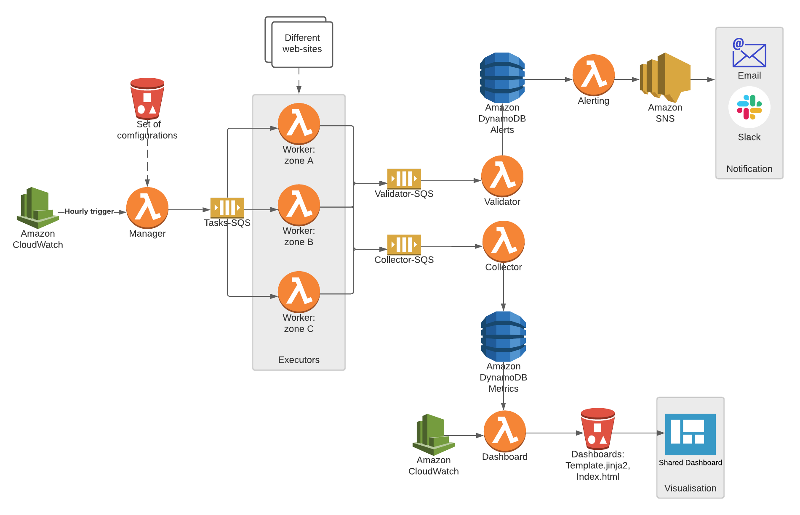

# Site Monitoring Tool

Program monitors web sites and reports their availability. This tool is intended as a monitoring tool for web site administrators for detecting problems on their sites.

## Main functions:
1. Reads a list of web pages (HTTP URLs) and corresponding page content requirements from a configuration file.
2. Periodically makes an HTTP request to each page.
3. Verifies that the page content received from the server matches the content requirements.
4. Measures the time it took for the web server to complete the whole request.
5. Writes a log file that shows the progress of the periodic checks.
6. Shows each monitored web site and their current status as html page via flask server.

## Functional schema


## Installation

Use the package manager [pip](https://pip.pypa.io/en/stable/) to install bs4, lxml, flask

```bash
> pip install bs4, lxml, flask
```

## Usage

```bash
# schedule monitoring and dashboard creation
> scripts/schedule_cron_task.sh

# run flask server to view dashboard
> scripts/dashboard_server.sh
```

## Configuration
1. Schedule

Update cron configuration in ```scripts/schedule_cron_task.sh```
```bash
cron_time="* * * * *"
```

2. Monitored urls

Update configuration in ```configuration.json```.

For example,
```json
[
    {
      "url": "http://hs.fi",
      "content_requirements": {
        "title": "Helsingin Sanomat"
      }
    },
    {
      "url": "https://www.aamulehti.fi",
      "content_requirements": {
        "title": "Helsingin Sanomat"
      }
    }
]
```

## Possible Cloud Architecture


## Contributing
Pull requests are welcome.

## License
Freely distributable.

## Author
Mariia Chernova. post.scriptumggg@gmail.com